# Architecture

## System Overview

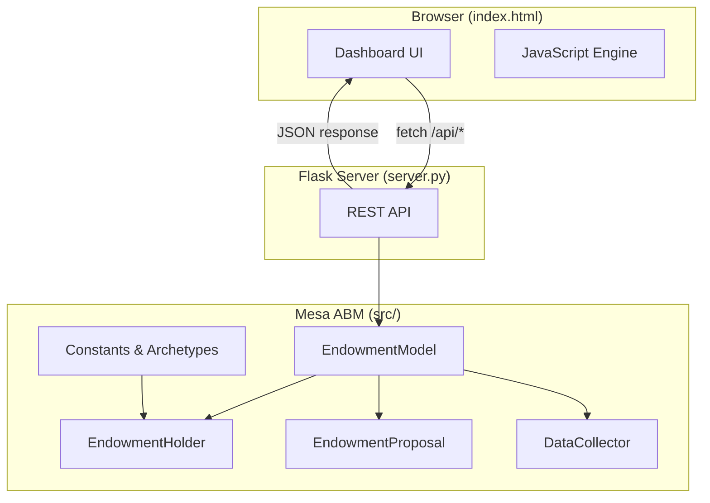

## Data Flow

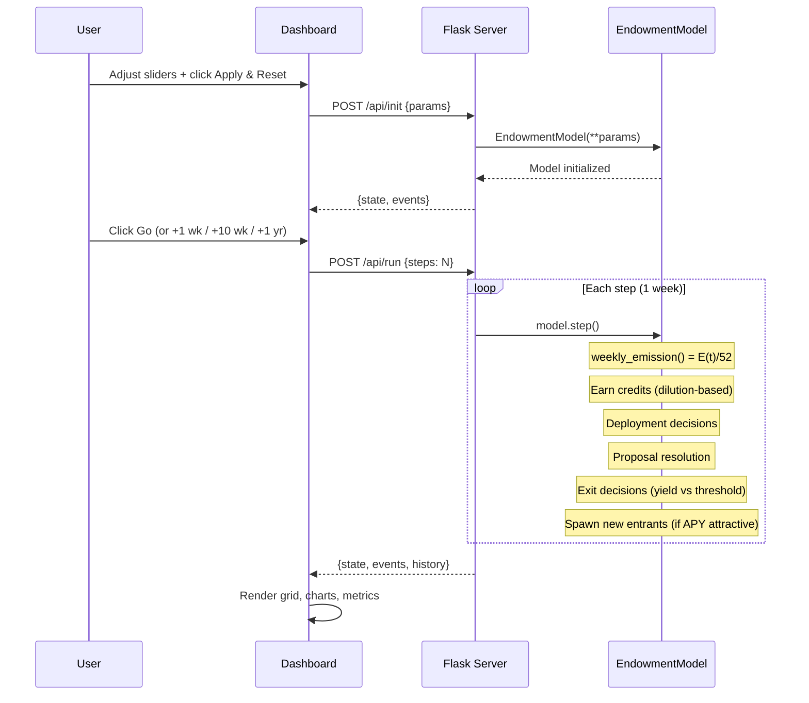

## Emissions Engine

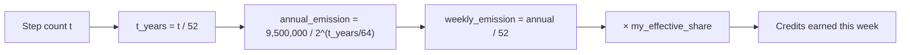

## Yield & Participation Rate

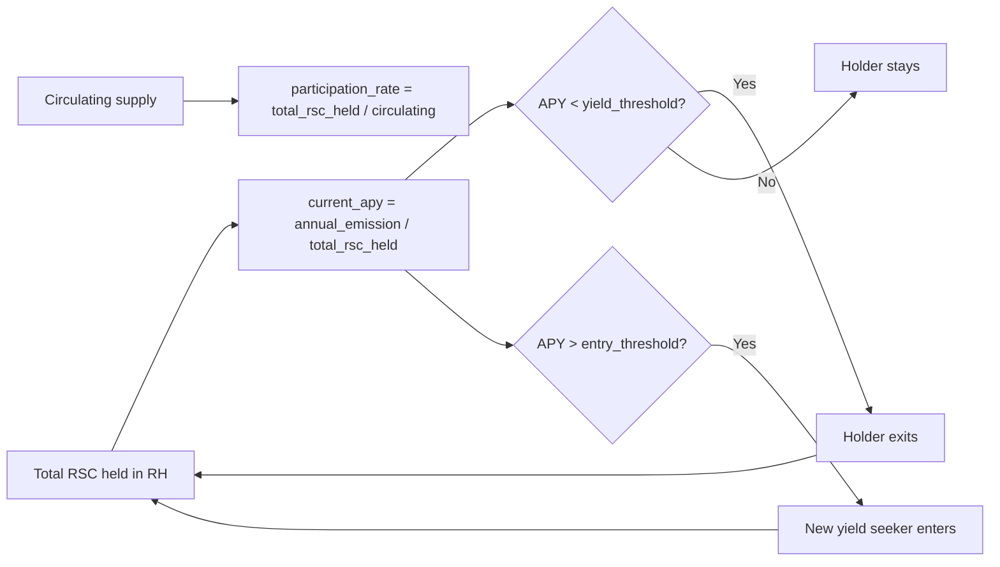

## Self-Balancing Mechanic

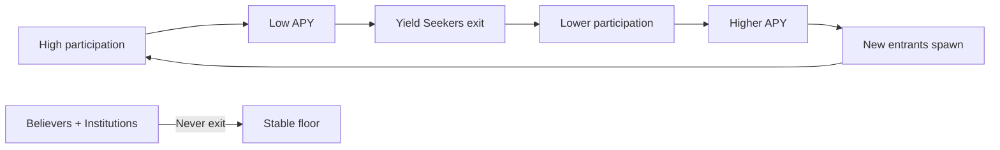

## Behavioral Model: B = f(P, E)

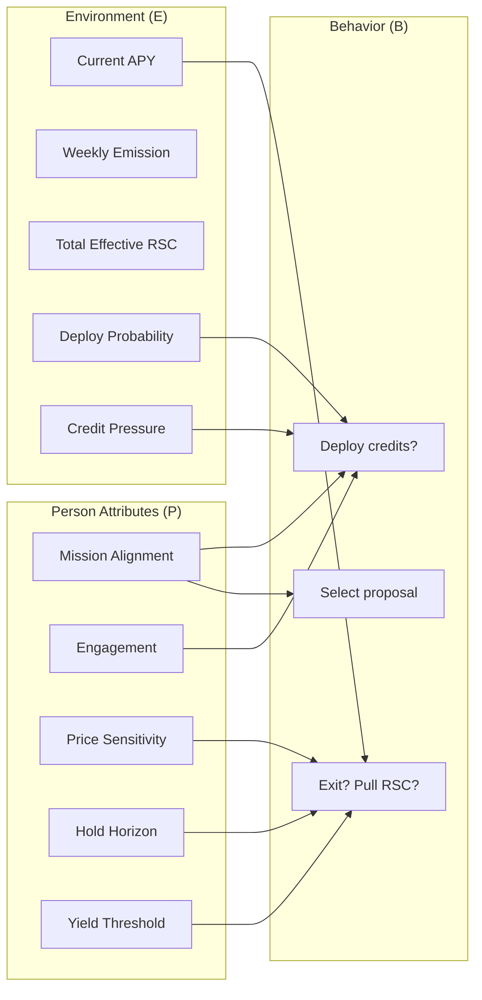

## Deployment Decision (_should_deploy)

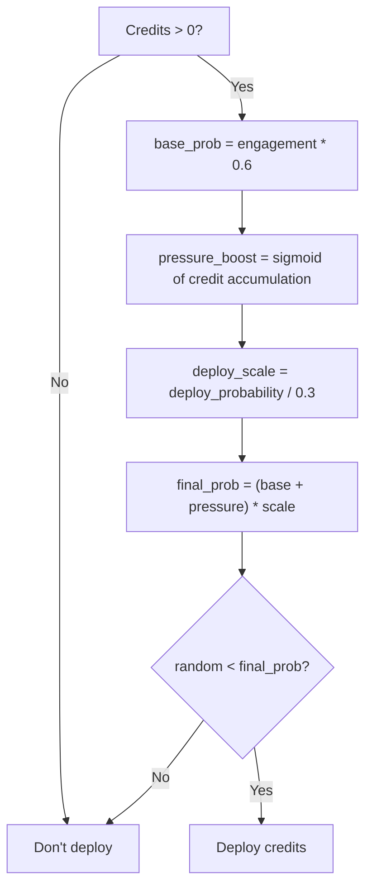

## Exit Decision (_consider_exit)

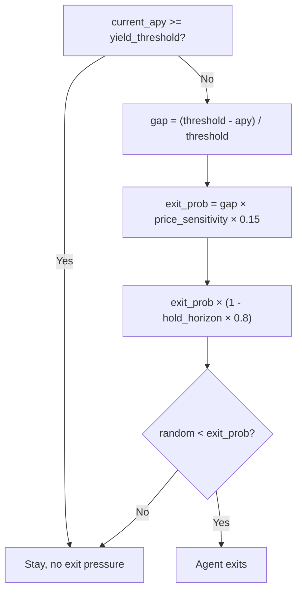

## Archetypes

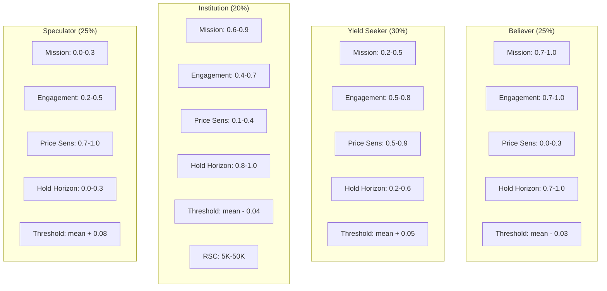

## Time-Weight Multipliers

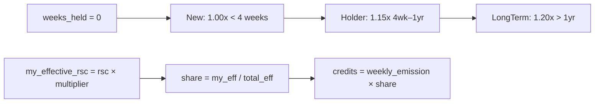

## Dashboard Layout

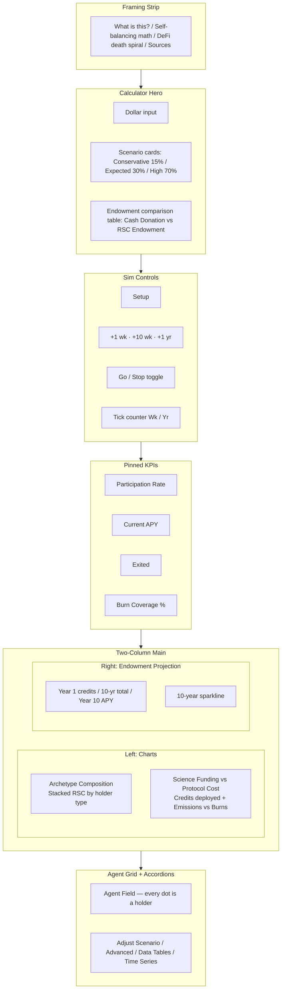

## Agent Field Grid Encoding

Each cell in the Agent Field grid encodes three dimensions:

| Visual Property | Data | Meaning |
|----------------|------|---------|
| Color | Archetype | Green=Believer, Gold=Yield Seeker, Purple=Institution, Red=Speculator |
| Opacity | Holding duration | 0.35=New (< 4wk), 0.65=Holder (4wk–1yr), 0.95=LongTerm (> 1yr) |
| Glow | Credit pressure | Bright edge = credits accumulating, needs to deploy |
| Grey | Exited | Holder pulled RSC from RH account |

## Parameter Flow (Slider to Backend)

```mermaid
graph LR
    subgraph Dashboard["Dashboard Sliders"]
        SY[Yield Threshold 1-25%]
        SD[Deploy Rate 0-100%]
        SS[Success 20-100%]
        SN[Holders 20-500]
        SB[Burn Rate 0.5-10%]
        SA[Archetype Mix]
    end

    subgraph Transform["JS getSliderParams()"]
        T1[/ 100]
        T2[parseInt]
        T3[/ 100 per arch]
    end

    subgraph Backend["EndowmentModel"]
        yield_threshold_mean
        deploy_probability
        success_rate
        num_holders
        burn_rate
        archetype_mix
    end

    SY --> T1 --> yield_threshold_mean
    SD --> T1 --> deploy_probability
    SS --> T1 --> success_rate
    SN --> T2 --> num_holders
    SB --> T1 --> burn_rate
    SA --> T3 --> archetype_mix
```

## Credit Lifecycle

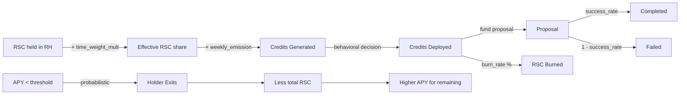
