# Architecture

## System Overview


## Data Flow


## Behavioral Model: B = f(P, E)


## Deployment Decision (_should_deploy)


## Archetypes


## Dashboard Layout


## Agent Field Grid Encoding

Each cell in the Agent Field grid encodes three dimensions:

| Visual Property | Data | Meaning |
|----------------|------|---------|
| Color | Archetype | Green=Believer, Gold=Yield Seeker, Purple=Governance, Red=Speculator |
| Opacity | Satisfaction | 1.0=fully satisfied, fading=losing satisfaction |
| Glow | Credit pressure | Bright edge=credits piling up, needs to deploy |
| Grey | Churned | Agent has left the system |

## Parameter Flow (Slider to Backend)

```mermaid
graph LR
    subgraph Dashboard["Dashboard Sliders"]
        SY[Yield 1-25%]
        SD[Deploy Rate 0-100%]
        SS[Success 20-100%]
        SN[Stakers 20-500]
        SB[Burn Rate 0.5-10%]
        SA[Archetype Mix]
    end

    subgraph Transform["JS getSliderParams()"]
        T1[/ 100]
        T2[parseInt]
        T3[/ 100 per arch]
    end

    subgraph Backend["EndowmentModel"]
        base_apy
        deploy_probability
        success_rate
        num_stakers
        burn_rate
        archetype_mix
    end

    SY --> T1 --> base_apy
    SD --> T1 --> deploy_probability
    SS --> T1 --> success_rate
    SN --> T2 --> num_stakers
    SB --> T1 --> burn_rate
    SA --> T3 --> archetype_mix
```

## Credit Lifecycle

```mermaid
graph LR
    STAKE[RSC Staked] -->|yield * tier_mult / 52| CREDITS[Credits Generated]
    CREDITS -->|behavioral decision| DEPLOY[Credits Deployed]
    DEPLOY -->|fund proposal| PROP[Proposal]
    DEPLOY -->|burn_rate %| BURN[RSC Burned]
    PROP -->|success_rate| COMPLETE[Completed]
    PROP -->|1 - success_rate| FAIL[Failed]
    COMPLETE -->|+satisfaction| SAT[Satisfaction]
    FAIL -->|−satisfaction| SAT
    SAT -->|low + unlocked| CHURN[Churn]
```


